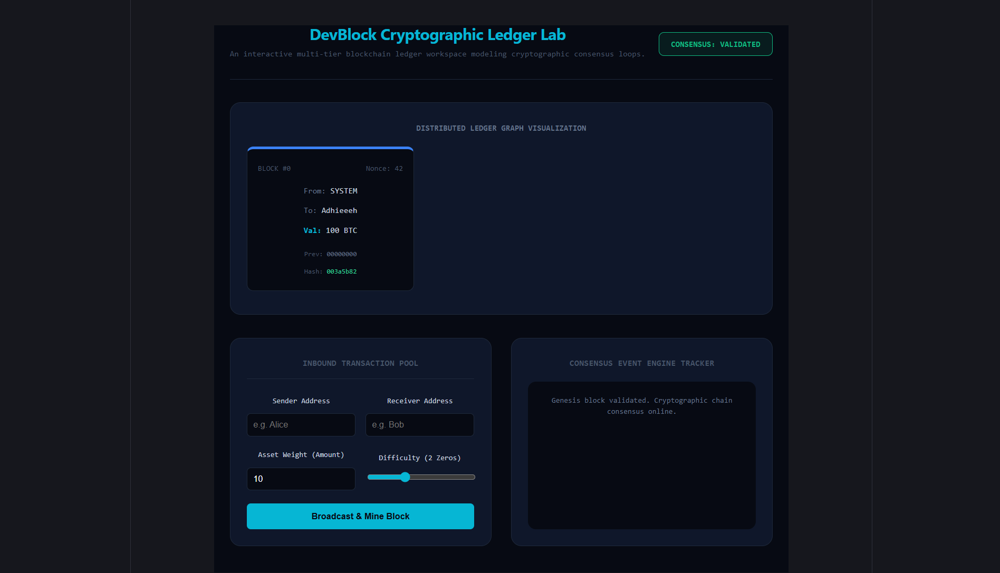

#  DevBlock — Interactive Client-Side Blockchain Ledger & Protocol Lab (React)
----------------------------------------------------------------------------------

DevBlock is a responsive frontend cryptographic workbench built using React component logic arrays. It structures a functional, multi-node sequential ledger loop entirely on the client side, utilizing string bit-shifting algorithms to emulate Proof-of-Work mining loops  and executing continuity checks to map structural data tampering anomalies in real-time.

##  Preview
----------------------------------------------------------------------------------

##  Technical Highlights Explored
---------------------------------------------------------------------------------

*  **Proof-of-Work Nonce Solvers:** Leverages non-blocking asynchronous timing hooks to process iterative string hashing functions until difficulty parameters match.
*  **Immutable Continuity Audits:** Runs comprehensive recursive mathematical verification loops down pointer indices to instantly flag array injection breaches.

##  Running Instructions
---------------------------------------------------------------------------------

1. Setup package targets: `npm install`

-----------------------------------------------------------------------------------
